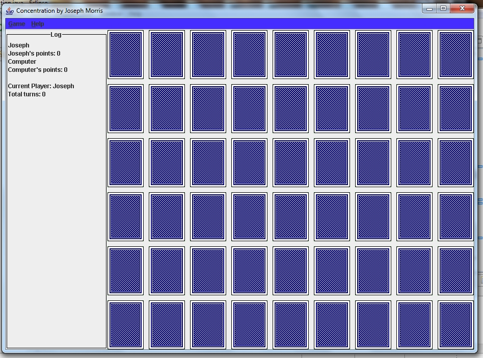

Name: Joseph Morris
Project #3, Concentration
Date: 11-23-10

# Note:
This code has not been edited or maintained since it was written. It serves as an early example of my explorations in coding.

# Description:

The purpose of this program is to explore the use of ActionListeners, MouseListeners, ActionEvents, GUI's, and basic computer AI through the creation of a classic card game known as concentration.NOTES ON GRAPHICS: The “cards” are JLabels that have been assigned an image. The images for the cards are open source and therefore can be used freely in the program. Multiple JPanels are used and positioned on the JFrame. Various layouts (especially GridBagLayout) are used to positions the elements on the content pane. An activity log is displayed to keep the user informed of the activity of the program. In addition, when the user goes to select cards, a mouseListener is added to the JLabels to enable the user to click on the cards that they want to select. SEE NOTES SECTION FOR MORE INFORMATION ON THE COMPUTER GAME AI AND EXTRAS!

# Included Files and INSTRUCTIONS FOR USAGE OF FILES:
README.txt
Concentration.java
Concentration.class
Concentration$1.class
Concentration$1.class
Concentration$1.class
Concentration$1.class
Concentration$1.class
Concentration$1.class
Concentration$1.class
Concentration$1.class
Concentration$1.class
Concentration$1.class
Concentration$1.class
Concentration$1.class
Concentration$1.class
Concentration$Card.class
Screenshot.jpg
cardImages <Folder>
Ace of clubs.gif
Ace of diamonds.gif
Ace of hearts.gif
Ace of spades.gif
Back.gif
Eight of clubs.gif
Eight of diamonds.gif
Eight of hearts.gif
Eight of spades.gif
Five of clubs.gif
Five of diamonds.gif
Five of hearts.gif
Five of spades.gif
Four of clubs.gif
Four of diamonds.gif
Four of hearts.gif
Four of spades.gif
Jack of clubs.gif
Jack of diamonds.gif
Jack of hearts.gif
Jack of spades.gif
King of clubs.gif
King of diamonds.gif
King of hearts.gif
King of spades.gif
Nine of clubs.gif
Nine of diamonds.gif
Nine of hearts.gif
Nine of spades.gif
Queen of clubs.gif
Queen of diamonds.gif
Queen of hearts.gif
Queen of spades.gif
Seven of clubs.gif
Seven of diamonds.gif
Seven of hearts.gif
Seven of spades.gif
Six of clubs.gif
Six of diamonds.gif
Six of hearts.gif
Six of spades.gif
Ten of clubs.gif
Ten of diamonds.gif
Ten of hearts.gif
Ten of spades.gif
Three of clubs.gif
Three of diamonds.gif
Three of hearts.gif
Three of spades.gif
Two of clubs.gif
Two of diamonds.gif
* Two of hearts.gif
* Two of spades.gif
* Red Joker.png
* Black Joker.png

README.txt:
This file.

Concentration.java:
This class contains the methods and subclasses needed for the card game to function.

# Parts Implemented:
All required elements implemented.

# Parts Not Implemented:
Variations (Extra)

# Notes:

Due to the nature of Swing threading, Thread creation/manipulation had to be utilized to avoid any errors.

In addition to the graphical interface, the dealer has been programmed with a basic artificial intelligence that functions in the following manner:

The computer is given two "memories". One for the cards that it has flipped over, and one for the cards that the user has flipped over. This is similar to how a human's memory would be divided during this game. When it is the computer's turn to select two cards it first checks its own memory to see if there are any cards that match. If a match is found, then the computer "remembers" the positions of the two cards and flips them. If there is nothing in the computer's "memory", it simply randomly selects two cards. When the computer randomly selects two cards, it has a certain percent chance to remember the value, color, and position of one of the cards it has flipped. This is roughly as much information as a human would remember given two flipped cards. This information is stored in the computer's "memory" for future use and comparison. When the user flips two cards, the computer has a percent chance to remember the color, suit, and position of one of the user's cards. This is stored in the second "memory-bank". If a match is found between the computer's "memory" and it's memory of the user's flipped cards, then it selects the matching elements and flips the corresponding cards.

# Known Bugs:
There are no known bugs.

# Extra Credit:
See Notes.

# Sample Output:
 
Please see screenshot for sample output.
